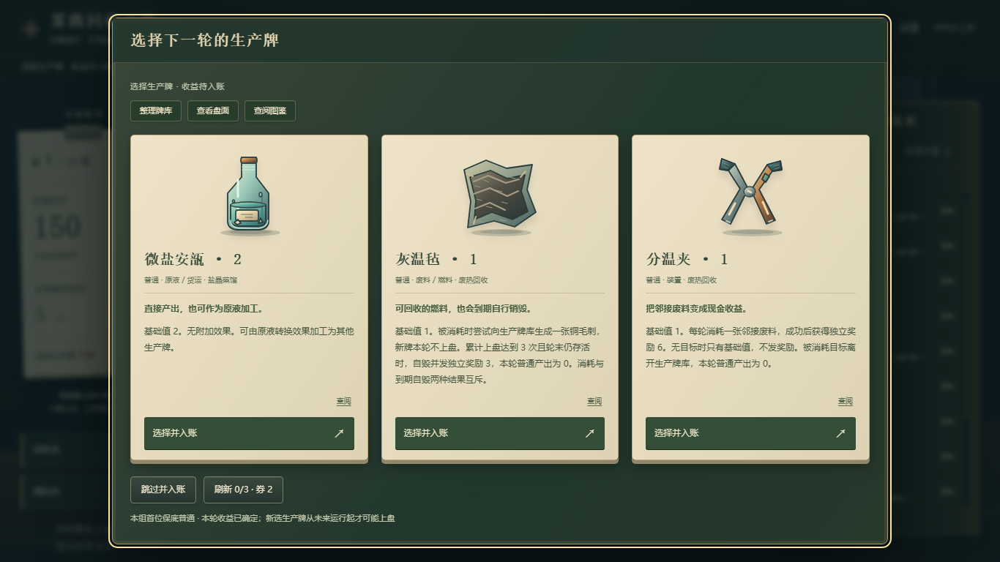
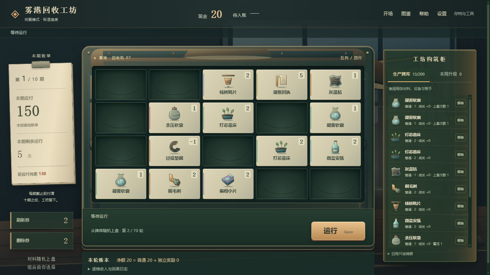
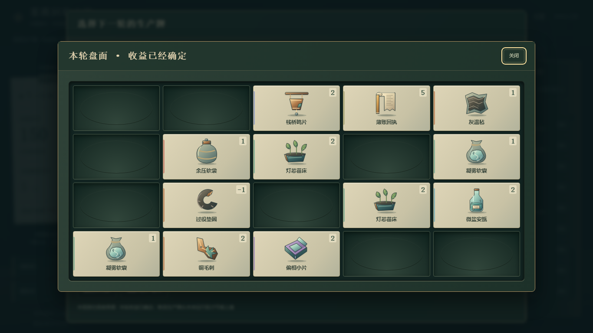
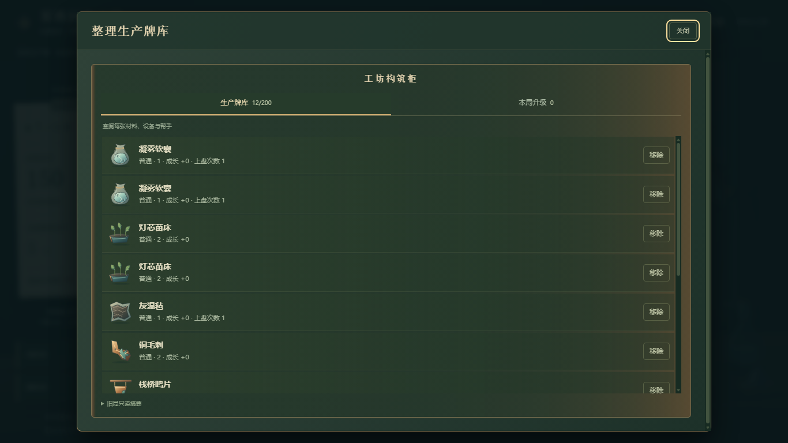
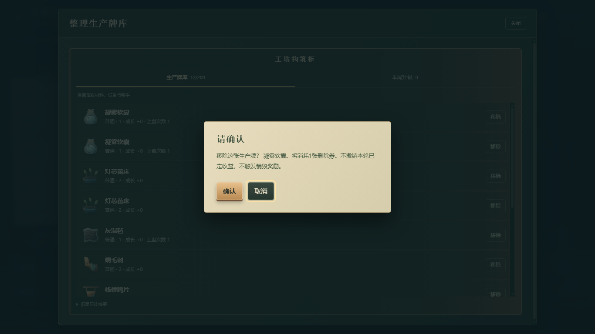
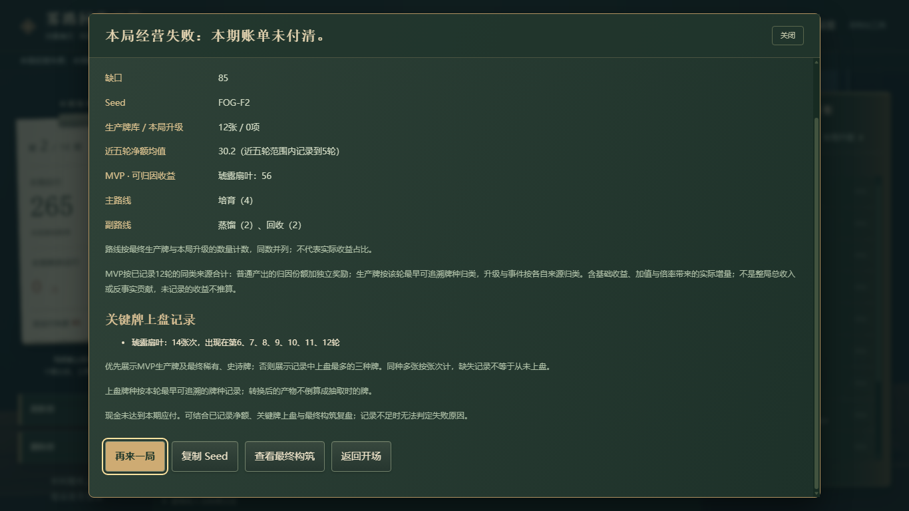
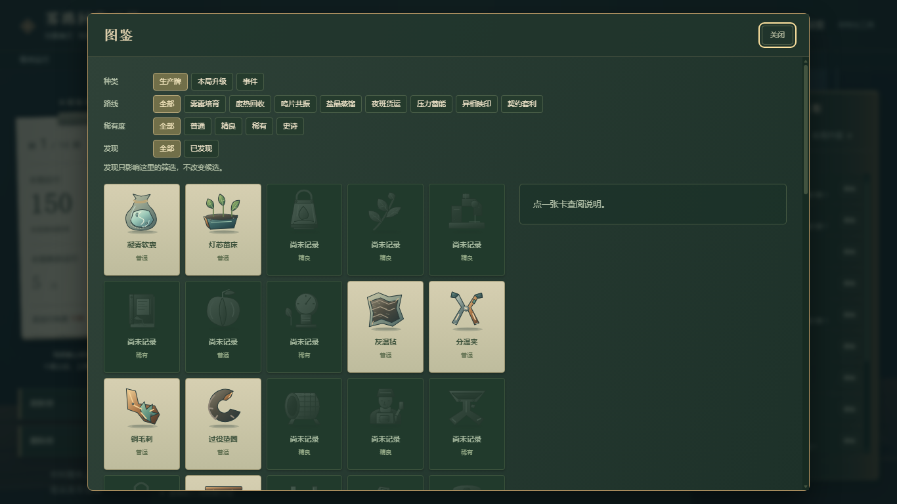
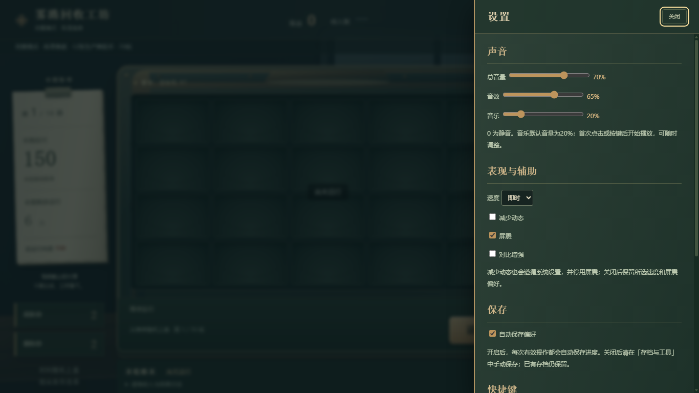

# 《雾港回收工坊》首局引导

## 一分钟开玩

用 Chrome 或 Edge 打开 **`gdd1.html`**（无需安装或联网）→ 点 **「开始完整模式」**，保留教程 → 点 **「运行」** → 看 **「待入账」** → **选一张或「跳过并入账」** → 看左侧账单，准备首期付款。

初次不要勾「本局不看教程」；若已看过或跳过，勾「再看一轮教程」。跟着教程操作即可，不必先背规则。

你接手了雾港的一间负债回收工坊。一盏灯，一台旧机器，让留下来的材料撑过下一张账单。**随机上盘，组合赚钱；付清10期账单，保住工坊。** 到期现金不足则本局失败，现金都是纯虚拟金额。

**首局必读：** 下面三张图带你完成一轮，再读选牌三问与首期付款。**随用随查：** 后半篇保留协作案例、移除、复盘、存档和完整数值，不必顺读。

## 首局必读：跟着同一局走一轮

以下沿用现有实机截图，按 **欢迎01 → 候选02 → 选择后工作台10** 展示同一局的先后状态。截图脚本为展示界面跳过了教程；你的首局建议保留，教程不会替你操作或改规则。候选与收入只是这次结果，不是固定奖励。图片可打开原图放大。

### 1. 从哪里开始？


*点「开始完整模式」，保留教程。已有进度时可能显示「继续」；若要重开，先导出要保留的存档，再留意覆盖确认。*

进入工作台后，跟随教程点「运行」。机器从生产牌库抽取至多20张，随机放进5列×4行；你不用、也不能手动摆牌或按停滚轮。起手只有12张，**空槽正常，不是漏发牌**。

### 2. 运行后，为什么钱还没到账？



*这时本轮收益已经算好，但仍是「待入账」。点候选的「选择并入账」，或点左下「跳过并入账」，钱才进入现金。*

- **选一张**：新牌加入未来会抽取的生产牌库，同时提交本轮收益。
- **跳过**：不加牌，**收益照样入账**，不是放弃这轮的钱。

**新牌不改本轮收益。** 它不是能当场打出的手牌，要到未来运行才可能工作；刷新或移除也不会重算本轮。查阅详情不会替你选牌，Esc不能绕过必须处理的候选。

### 3. 选完以后，我改变了什么？

[](docs/images/10-first-workbench.png)

*这次选择了第一张「微盐安瓿」：现金20、待入账清空，牌库从12变13；盘面仍是刚才工作的12张，空槽依然正常。若刚才跳过，同样入账20，但牌库仍为12张。*

**盘面不等于牌库：** 中间是本轮工作的牌，右边是未来运行抽取的整副牌库。新选的牌不会补进旧盘面，下一次运行才重新抽取和摆放。

现在只看两处：顶栏确认现金到账；左侧看「本期应付」「本期剩余运行」。图中应付150、还可运行5次、尚差130，**不是现在就失败**。下方「运行」开启下一轮，「本轮账本」可追查刚才的收入。

## 首局必读：选牌只问三问

1. **和现有牌有什么配合？** 我已经有它需要的材料或帮手吗？它能补料、加工，还是提供稳定收入？同标签不代表自动合作。
2. **要付出什么代价？** 会吃掉材料、留下垃圾、增加账单，还是需要等待成熟或随机邻接？
3. **值得加入现在的牌库吗？** 是马上有用途，还是为了遥远组合囤牌？超过20张后，还要权衡关键件的上盘机会。

拿图02作练习，而不是必拿清单：

- **微盐安瓿**基础值2，不等加工器也能直接产出；图中牌库还小，可以考虑填空。但它不是救本轮付款的额外2现金。
- **分温夹**能吃邻接废料，起手就有可用材料，且它是装置，可给铜毛刺提供配合。不过随机上盘不保证邻接，吃完之后也可能缺料；不要把消费奖励和被吃目标的普通产出重复算。
- **灰温毡**可以供回收，或等自身到期兑现；若你已经有料却缺处理器，再拿一张不一定解决问题。

稀有度高不等于适合。三张都没明确用途时，**跳过并入账完全合理**。首局不用花光刷新券找「必拿」，也不急着删牌；先观察一次选择在后续运行是否帮上忙。

## 首局必读：准备第一次付款

重复「运行 → 看待入账 → 选择或跳过」。**完整模式首期共6轮，基础账单150**；事件或借支可能增加应付，以左侧账单为准。现金可以跨期保留，还有余轮时现金不足不等于失败。

到最后一轮，仍要先处理候选，然后收益入账，系统才自动检查付款：

```text
运行 → 随机上盘并结算 → 收益待入账
     → 选一张或跳过 → 收益加入现金
     → 到期时自动检查并支付账单
```

例如现金120、待入账20、应付150，入账后140，仍缺10。**最后才拿一张高收益牌，救不了这次付款缺口。** 这只是算账示例，不是付款截图。

付清后自动扣款、留下余额；第1–9期接着选一项「本局升级」（也可放弃），从下一期起生效。第10期扣款后直接胜利，没有第10项升级。

**到这里就可以继续玩了。** 首局先完成一轮、认清牌库与盘面，再观察一次成熟或协作；不必把首局通关当作学会的证明。

---

## 随用随查：先查眼前的问题

### 想换模式或重看教程？

| 想怎么玩 | 欢迎页按钮 | 「存档与工具」中的按钮 |
|---|---|---|
| 完整模式 | **开始完整模式** | **新完整模式** |
| 精简模式（试验） | **开始精简模式（试验）** | **新精简模式** |

精简模式只含培育、回收、蒸馏，适合先熟悉较少的内容；基础账单是完整模式的65%向上取整，**约低35%**，首期98。它仍是10期、70轮，不是更短的教程，也不保证更容易通关。下面的入门协作案例两种模式都能试。

内部字段 **Normal** 表示界面的标准难度，两种模式目前都沿用它；选择精简模式主要是减少要认识的内容。

欢迎页新局可以观看六步教程，随时点「跳过教程」；初次可勾选「本局不看教程」，看过或跳过后可勾选「再看一轮教程」。继续和导入不会重启教程。

打开或刷新总是先到欢迎页，局内点「开场」可返回。

新局从**12张生产牌、现金0、刷新券2、删除券2**开始。已有存档时请在欢迎页点击对应的「继续」；要重开请用相应「新」按钮，注意覆盖确认。想保留进度，可先「导出」。

### 想回看刚才的盘面？



*这是候选阶段点「查看盘面」后的实机画面。看完关闭查看层会回到候选，仍须选牌或跳过才能入账。*

一张牌本轮不会被重复抽取；同名两张是不同的牌。少数明确的保留、抽取权重效果可以影响未来出现机会或位置，但不是自由摆位。

### 想查看整副牌库？



*图中是候选阶段打开的「整理生产牌库」窗口，不是另一副牌。它与工作台右侧构筑柜查看的是同一牌库；可切到「本局升级」，长列表在柜内滚动。关闭后返回候选。*

牌库是未来会抽取的集合，盘面只是其中本轮工作的牌。点击某一行可查看该张牌的详情，技术编号只在详情中出现；永久成长与计数各自独立，同名牌不共享成长。

### 想看懂配合？先观察一组，不必凑齐整套

效果里的「邻接」默认包括上下、左右和斜角，不跨边界；「同排」只指同一横排。**同时上盘不等于一定相邻。** 下面不是必拿清单，遇到合适候选时选一组观察即可。

#### 铜毛刺 + 装置：最直接的加值

**铜毛刺**基础值2，邻接任意**装置（machine）**时，自身+2。若没有其他修饰且最后仍存活，它就产出4。

可以观察：新选装置未来上盘后，有没有靠近起手的铜毛刺？毛刺的收入有没有提高？装置不需要和毛刺同一标签才有配合。

#### 凝雾软囊：让材料慢慢成熟

无加速时，同一张**凝雾软囊**第3次上盘转换为**露灯苞**；这张露灯苞再上盘2次，转换为**琥露扇叶**。基础值随之从1变成3，再变成4。

这里数的是**这张牌实际出现的次数**，不是全局已经运行几轮。牌库变大后，它可能有几轮没有上盘。补雾工等明确的加龄效果可以提速，但不是所有升级都加速成熟。

探索小目标：在牌库里追踪一张软囊，看它何时换名字。转换保留这张牌的身份与通用永久成长，不是另选一张新牌。

#### 分温夹 + 废料：兑现材料，但会失去目标

**分温夹**基础值1，每轮消耗一份邻接**废料（scrap）**，获得**独立奖励6**。无目标时只有基础1，没有额外奖励。

被消耗的牌会离开牌库，**本轮普通产出为0**。所以不能把目标原本收入与消费奖励都当作白赚。若吃到**灰温毡**，灰温毡会生成一张铜毛刺留在牌库，未来才可能上盘；不是本轮立即填回空格。

起手本就有废料，不必等到后期才考虑消费者；但也要问「吃完之后还有料吗？」。反过来，留着已经长得很好的成品持续生产，有时比消耗更合算。

#### 微盐安瓿 + 凝潮盘管：加工成更值钱的牌

**凝潮盘管**每轮转换一个邻接**原液（feedstock）**为**潮棱块**，微盐安瓿就是可用原液。潮棱块基础值4，转换成为它的这一轮自身额外+3；无其他修饰且存活时普通产出为7。以后直接上盘不再自动重复这次+3。

观察加工后的牌库：原来的那张安瓿变成了潮棱块，盘管还在，但之后可能缺原料。组合乐趣不只是「两张碰上」，也包括给加工器补料、保留产物或把产物交给其他效果。

**看不懂一轮收入时：** 展开底部「本轮账本 → 逐格收入与因果日志」。先看净额怎样分成普通产出和独立奖励，再找一张熟悉的牌核对收入、倍率与归因；中文因果记录会解释来源、目标和效果，不必逐条读完。

### 选或跳过：看未来，不给本轮补分

牌库**不超过20张**时，已有牌都会上盘，新增正收益牌通常是在填空，不必然稀释原牌出现率。不过它仍可能改变空格条件、邻接关系。

牌库**超过20张**后，每轮只有至多20张工作，才需要权衡关键件的出现机会。等权时单张出现率可粗看作 `20 ÷ 牌库张数`；有权重效果时不能当作精确概率。

不要把「20–30张」当铁律，也不要见重复就删。重复的供料可能有用；但要求「不同种类」的效果不会把三张同名牌算成三种。多路线可以合作，关键是实际收益，不是标签整齐。

三张都没有明确用途时，**跳过并入账**完全合理：收入照常到账，牌库保持不变。

### 刷新：为明确需要花券

在候选窗口点「刷新」，**每次消耗1刷新券，替换整组三张候选，同一窗口最多3次**。不是重抽盘面，不改变待入账，也不保证一定看到想要的牌。若该组有保底，刷新会消耗本组保底，界面会要求确认。

知道自己缺什么时再考虑刷新；不要为了一张所谓「必拿」牌耗尽所有券。

### 移除前要确认什么？

等待运行时使用右侧「生产牌库」，生产牌选择阶段先点「整理牌库」，再点某张牌旁的 **「移除」**，在工坊确认框中核对成本：花1删除券，移除这张牌，并丢失它的成长与计数。

[](docs/images/09-remove-confirm.png)

*先核对牌名和删除券成本。默认焦点在「取消」；点取消或按Esc都不会移除或花券。键盘Tab切换按钮，Enter激活当前聚焦的按钮，只有明确确认才执行。*

- 库超过20张时，移除低贡献牌可能改善核心同盘机会，但不保证相邻或盈利。
- 库不超过20张时，移除不提高其他牌的上盘率；可能去掉负收益，也可能失去供料或改变空格条件。
- **垃圾（junk）不等于废料（scrap）**。过役垫圈同时有两者，可以被回收或转换，不是见到就必须立刻删除。
- 主动移除不是效果里的消耗或销毁，**不会触发对应奖励**，也不会撤销本轮已定收益。

### 本局升级：改善已有工作方式

成功付完第1–9期后，会出现升级三选一；右侧构筑柜切换到「本局升级」，可查看升级与临时效果。它们**不上盘，只在本局有效，从下一期起发挥作用**，不会追溯补发已经错过的收益。没有合适项也可点「放弃本局升级」。

例如已经能反复回收废料，分温围裙就有明确用途；尚无配套时，不要只因升级名字好听就期待它自动赚钱。

期间遇到事件也可以点 **「不参与」**。事件弹层给出中文方案、费用与目标选择；确认前检查真实收益和代价，不参与不会被强制收费。

### 失败后怎样复盘？



*图中是之后正常游玩到失败的复盘，不是首期付款成功图。结局层区分完整与精简模式，提供「再来一局」「复制 Seed」「查看最终构筑」「返回开场」。胜利现金是付款后的余额；失败展示应付、可付现金和缺口。*

复盘还显示近五轮净额均值、MVP 可归因收益、主副路线和关键牌上盘记录。统计只使用本浏览器保存的 UI 记录：近五轮缺记录会注明数量，不推算缺失轮次。MVP 按同类来源的普通产出归因份额与独立奖励合计，不等于整局总收入或反事实贡献；路线按最终牌与升级数量统计，同数并列，不代表收益占比。

失败后不要立刻认定「牌库太大」或「没抽到史诗」。用账本与牌库先检查一个问题：

- **原本期待什么收入？** 是成熟没等到，还是某个效果条件读错了？
- **材料与处理器是否匹配？** 消费者是不是吃完材料后只剩基础值？有没有把高成长牌当原料？
- **关键件有没有出现并靠在一起？** 大牌库可能降低同盘机会，随机位置也可能让同盘组合无法协作。
- **本期应付是否增加？** 事件或借支的额外义务也要付，不只是看基础账单。

下局只改一件事试试，例如少拿一张没用途的牌，或提前补一份能用的原料。记下 Seed 可帮助复盘；只有相同版本、模式、Seed与相同操作才会复现相同结果，改决策后不保证仍出现原来的盘面。

### 操作速查

| 当前操作 | 怎么理解 |
|---|---|
| 运行 | 从生产牌库随机上盘，算出待入账 |
| 选择生产牌 | 选一张未来用的生产牌，或跳过 |
| 跳过并入账 | 不加牌，仍提交本轮收益 |
| 生产牌库 / 移除 | 生产牌库 / 花券移除某一张 |
| 本期应付 / 本期剩余运行 | 本期应付 / 本期剩余运行次数 |
| 本局升级 / 临时效果 | 本局升级与临时效果 |

鼠标可以完成全部操作，不需要快捷键。在「设置」可调整自动保存、总音量、音效、音乐、速度、减少动态、屏震和对比增强；音乐为32秒程序合成循环，默认音量20%，首次点击或按键后开始播放；设置中可以调节或静音，并保留你的选择。手动「存档」「导出」「导入」在「存档与工具」中；不同浏览器、`file://` 与 `http://` 的存储不共享，移动目录或清理浏览器数据前先导出。更多存档说明见 [README](README.md#存档)。

常见标签：植物（plant）、雾料（mist）、燃料（fuel）、装置（machine）、废料（scrap）、垃圾（junk）、原液（feedstock）、成品（product）、晶体（crystal）。完整标签与术语对照见 [玩家语言分册](docs/GAME_IDENTITY.md#3-术语对照玩家界面统一用新词)。**标签是效果的筛选条件，不是自动生效的套装或路线。**

### 图鉴、详情、帮助与设置



欢迎页或局内点「图鉴」。完整模式共104项：64张生产牌、32项本局升级、8个事件；局内按当前模式显示合法内容。可按种类、生产牌路线、稀有度与已发现筛选。未发现项目显示「尚未记录」和轮廓，遮蔽名称及完整效果。已持有、候选中见过的牌与升级、已遇到的事件会记入发现；发现只影响展示，不改变候选概率。

点击盘面、牌库、本局升级或候选「查阅」可打开详情，看用途、完整效果、成长与计数。「帮助」提供玩法、15种标签、8条工作线和快捷键。



| 快捷键 | 作用 |
|---|---|
| Space | 等待运行时运行；演出中跳过演出；候选时跳过生产牌或升级。焦点在按钮时保留按钮原生激活行为。 |
| 1 / 2 / 3 | 选择对应生产牌或升级候选 |
| S | 跳过生产牌候选或放弃本局升级 |
| R | 刷新生产牌候选；消耗保底仍需确认 |
| Esc | 关闭最上层可关闭的查阅层；不能绕过必要选择 |
| Tab / Shift + Tab | 前后移动焦点；弹层内循环 |

输入框、教程、确认框及其他查阅覆盖层会阻止游戏快捷键误触；长按和组合键不重复执行。图鉴发现、设置、教程偏好与复盘统计单独存于浏览器，不包含在游戏 JSON 存档中；换浏览器或只导入游戏存档后，旧统计可能不完整。

### 选读：想核算一轮时再看公式

```text
存活且未被效果规定普通产出归零的牌，其普通产出 = 向下取整[(基础值 + 永久成长 + 临时加值) × 倍率]
本轮净收益 = 各格普通产出之和 + 独立奖励
```

脉冲釜即使存活，普通产出始终为0；释放时的独立奖励另计，按牌面特殊规则。

死亡或被消耗的目标普通产出为0；明确的独立奖励另算，**不吃倍率**。永久成长只跟随某一张牌，且只在本局有效，不是账号成长。

如果想估计付款压力，可用「尚缺现金 ÷ 剩余轮数」作参考，不是每轮硬性门槛。完整模式各期轮数为 `6、6、7、7、7、7、7、7、8、8`；当前基础账单为 `150、265、400、425、445、450、455、475、550、585`。**B1数值调整方案尚未执行，这里仍按当前实现，不采用拟议数值。**例如无结余、无增额时，终期平均需73.125/轮；实际还要考虑波动、结余与代价，不是「只堆基础值必败」的证明。

### 选读：完整模式的共鸣，不是入门必选路线

**和音框**基础值2，检查相邻组合时，需要邻接至少两种其他**共鸣（resonance）**牌，才使其中一个邻居普通产出×2。不是同排两种就能触发，也不是全排或全盘翻倍；选定目标后来死亡不会补选。

「不同种类」按名字对应的类型数算，重复牌不增加种类。**静拍保管员**反而需要所在排只有自己一个共鸣才能自身+10，因此稀疏与密集共鸣有冲突，不应把它们当无条件叠加的最强套装。

**公用节拍器**加快拍点线轴等拍点计数，不加速年龄或蓄压，不当场触发旧计数。精简模式没有这组共鸣内容，可以跳过本段。

### 选读：先支邮戳的借支代价（完整模式）

默认拒绝，只能在「等待运行」时设置接受。接受后，每期该张邮戳首次在接受状态下上盘获得独立奖励18，同时**本期应付+12**，并尝试生成待核欠条。

18先进入本轮待入账，处理候选后才入现金；勾选不会立即发钱。相对新增义务只多6，还要考虑垃圾、占位与出现时机，不是「钱够白送」，也不能仅凭「缺钱」决定一定拒绝。关闭接受或移除邮戳都**不撤销已加的义务**；欠条生成失败也不免除付款。

---

**现在就试一轮：运行，看看待入账，选一张或跳过。下一轮再观察：刚才的选择有没有帮上忙？**

设计规则入口：[GDD](docs/GAME_DESIGN_V1.md)。其中初版经济与界面规划不等于当前实现；本手册的账单与按钮按现有游戏核对；功能实现不代表已通过真人理解、平衡或真实设备听感验收。
