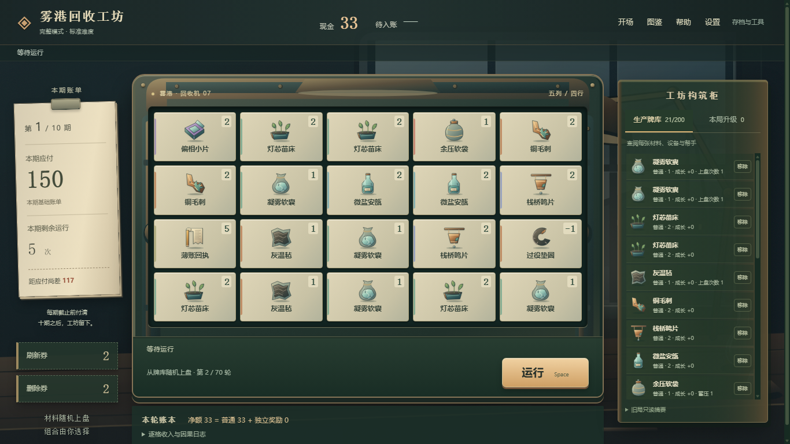

# 雾港回收工坊

一款可在浏览器中离线游玩的概率构筑游戏。你接手一间负债的回收工坊，让材料、设备与帮手在随机盘面上协作赚钱，在截止前付清十期账单，保住工坊。

**随机上盘，组合赚钱；每轮选一张生产牌或跳过，逐步调整自己的生产牌库。** 游戏中的现金均为虚拟金额。

[开始游玩](#快速开始) · [玩家手册](PLAYER_GUIDE.md) · [开发与测试](#开发与测试) · [设计文档](docs/GAME_DESIGN_V1.md)


## 特点

- **离线即玩**：原生 HTML、CSS 与 JavaScript，无需安装依赖或构建；运行时不请求网络资源。
- **八条工作线**：培育、回收、共鸣、蒸馏、货运、蓄压、异相与契据，可围绕实际效果搭配构筑。
- **完整内容图鉴**：64 张生产牌、32 项本局升级和 8 个事件，配有中文用途、效果说明和发现记录。
- **雾港夜班工作台**：冷雾窗景、暖灯旧铜机器、纸面账单与96件彩色物件插画，配合原创合成音效和循环配乐。
- **可查阅的结算**：查看盘面、实例成长、中文因果账本和结局复盘，了解收入从何而来。
- **可调节的操作体验**：可跳过教程、键盘快捷键、演出速度、减少动态、对比增强及独立音量设置。



## 快速开始

下载或克隆仓库后，用 Chrome 或 Edge 打开根目录的 **`gdd1.html`**。玩家无需安装 Node.js、Python 或其他工具。

每次打开或刷新都会进入欢迎首屏。选择「开始完整模式」或「开始精简模式（试验）」；已有存档时，点击对应的「继续」恢复进度。

音乐默认音量为 **20%**，首次点击或按键后开始播放。可在「设置」中调整或静音，之后会保留你的选择。

开发时也可以使用本地 HTTP 服务，例如已安装 Python 时：

```sh
python -m http.server 8000
```

然后访问 <http://localhost:8000/gdd1.html>。本地服务仅是可选的访问方式，游戏本身不依赖后端。

## 玩法与操作

一局包含十期账单，共七十轮。每轮从生产牌库无放回抽取至多二十张牌，随机排入 **5×4** 盘面。不能手动摆牌；你通过选牌、本局升级、事件、刷新与移除调整未来的组合。

```text
运行 → 随机上盘并结算 → 选择生产牌或跳过 → 收益入账
                                           ↓
                                  到期付款 → 选择本局升级
```

「待入账」是本轮已确定但尚未加入现金的收益，处理候选后才会到账。新选的牌从未来运行起才可能发挥作用，不能改变本轮收益，也不能补救当期最后一轮的付款缺口。付清十期账单获胜；到期入账后仍付不起则本局失败。

| 模式 | 内容 |
| --- | --- |
| 完整模式 | 八条工作线，完整生产牌、升级与事件内容 |
| 精简模式（试验） | 培育、回收与蒸馏的部分内容；同为十期七十轮，基础账单约低35% |

两种模式分开存档。精简模式用于体验较少的内容，并不代表更短的教程或保证通关。

鼠标可以完成全部操作，也可使用快捷键：

| 按键 | 操作 |
| --- | --- |
| `Space` | 运行；演出中跳过演出；候选阶段跳过 |
| `1` / `2` / `3` | 选择对应生产牌或本局升级 |
| `S` | 跳过生产牌或升级候选 |
| `R` | 刷新生产牌候选，消耗刷新券 |
| `Esc` | 关闭最上层可关闭的查阅面板 |

焦点位于按钮时，`Space` 保留该按钮的原生操作；输入框、教程和确认框会阻止游戏快捷键。必要的候选选择不能用 `Esc` 跳过。

第一次游玩建议开启欢迎页教程。完整说明、组合示例和截图见 [玩家手册](PLAYER_GUIDE.md)。

## 存档

默认在有效游戏操作后自动保存，可在设置中关闭。「存档与工具」提供手动保存、JSON 导出与导入。

- 进度保存在当前浏览器的本地存储中，没有云存档。
- `file://` 与 `http://` 的存储不共享；浏览器、地址或本地文件位置变化也可能影响存档访问。清理浏览器数据或移动游戏前，建议先导出备份。
- 教程偏好、设置、发现记录与复盘统计独立保存，不随对局 JSON 一起导入导出。
- 结局统计只使用已记录的轮次；导入旧局后，缺失的历史记录不会补造。

## 开发与测试

代码使用经典浏览器脚本，无 npm 依赖、打包器或构建步骤。修改文件后刷新 `gdd1.html` 即可查看效果。开发测试建议使用 **Node.js 22 或更新版本**。

在仓库根目录运行：

```sh
# 日常自检：机制、图标、声音、动画隔离、玩家文案和设置
node tests/tools/run-all.js

# 当前 GDD1 完整模式规则测试
node tests/gdd1/f4-run.js

# legacy 原型回归测试
node tests/run.js
```

浏览器交互与截图测试：

```sh
node tests/gdd1/welcome-shot.js
node tests/gdd1/tutorial-shot.js
node tests/gdd1/codex-shot.js
node tests/gdd1/shell-shot.js
node tests/gdd1/animation-shell.js
node tests/gdd1/visual-shot.js   # 四档尺寸、满盘、焦点和离线资源
node tests/gdd1/confirm-shell.js # 确认/取消、键盘及嵌套焦点
node tests/gdd1/visual-edgecases.js # 长文、极值与减少动态
```

这些浏览器脚本目前使用 Windows 上的 Microsoft Edge，并依赖脚本中的安装路径；在其他环境运行前需调整浏览器路径。测试会启动临时浏览器配置，并生成或更新截图、部分测试报告。工具说明见 [tests/tools/README.md](tests/tools/README.md)。

### 目录结构

```text
gdd1.html          浏览器游戏入口
css/gdd1.css       界面样式与视觉令牌
js/gdd1/           游戏规则、随机数、内容、结算与存档
js/gdd1UI/         场景、音频、动画、教程、查阅与玩家界面
assets/art/        原创场景、物件SVG、烘焙PNG与图集
tools/art/         素材重建与检查工具（游玩时不需要）
tests/gdd1/        当前游戏的规则与浏览器测试
tests/tools/       开发自检工具
legacy/            保留用于回归测试的旧原型
docs/              设计文档与素材说明
docs/images/       玩家手册截图
docs/archive/      历史记录
PLAYER_GUIDE.md    图文玩家手册
```

### 代码约定

- 规则逻辑与表现层分离：先提交结果与存档，再播放演出；动画速度不能影响最终状态。
- 保持确定性：相同 Seed 与相同操作得到相同结果。规则随机数使用显式 RNG 流，不使用 `Math.random()`。
- 保持命令事务完整：失败操作不能留下部分修改；涉及存档格式的变更须考虑兼容性。
- 保持运行时离线：资源随仓库提供，不引入 CDN、在线字体或远程素材请求。
- 调整机制时，用规则依据和独立推导验证期望值，不为消除测试失败而直接改写预期结果。

文档入口：[文档导航](docs/README.md) · [游戏设计](docs/GAME_DESIGN_V1.md) · [故事与玩家语言](docs/GAME_IDENTITY.md) · [视觉规范](docs/VISUAL_SPEC.md)。过期计划、提案与阶段报告见[历史归档](docs/archive/README.md)。

## 贡献与问题反馈

欢迎提交问题报告、文案建议、界面改进和代码贡献。请先阅读[贡献指南](CONTRIBUTING.md)，再在 [Issues](https://github.com/funct1ons/LuckLandlord/issues) 中选择问题反馈、功能与玩法建议或文档改进模板。提交 PR 时请填写仓库提供的模板。

报告游戏问题时，请尽量提供：

- 浏览器与系统版本，以及使用 `file://` 还是本地 HTTP 服务。
- 游戏模式、Seed、复现步骤与实际结果。
- 预期行为，以及有助于定位问题的截图或导出存档。

提交修改时，说明解决的问题和验证方式；界面改动附截图，规则改动附对应测试。较大的玩法或存档变更建议先讨论设计与兼容方案。

## 许可与素材

仓库目前没有提供项目级 `LICENSE` 文件，尚未声明统一的开源许可证。

插画、SVG/PNG场景和程序合成声音的来源、生成方式见 [素材记录](docs/ASSET_LICENSES.md)。素材来源说明不等同于项目代码或素材的使用许可。
